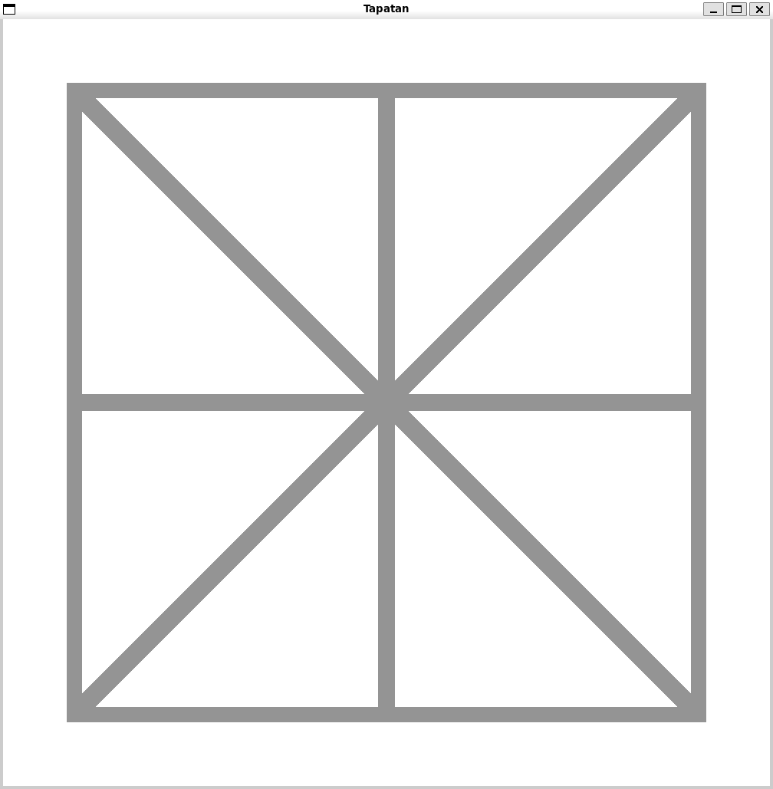
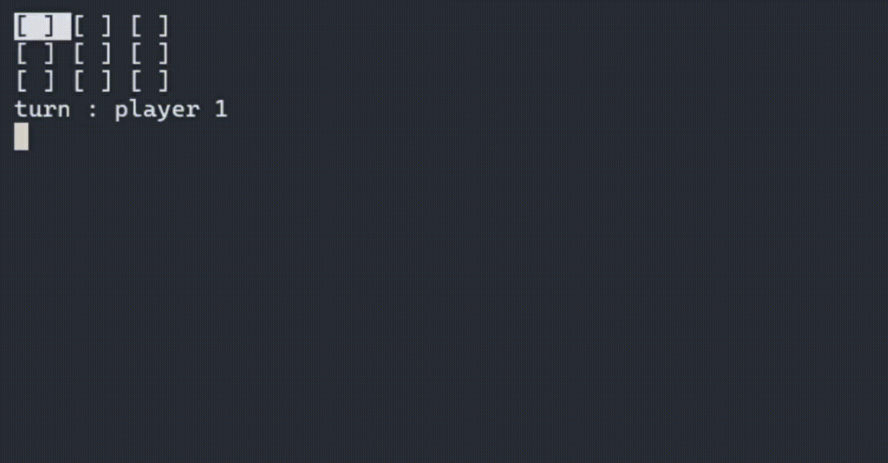
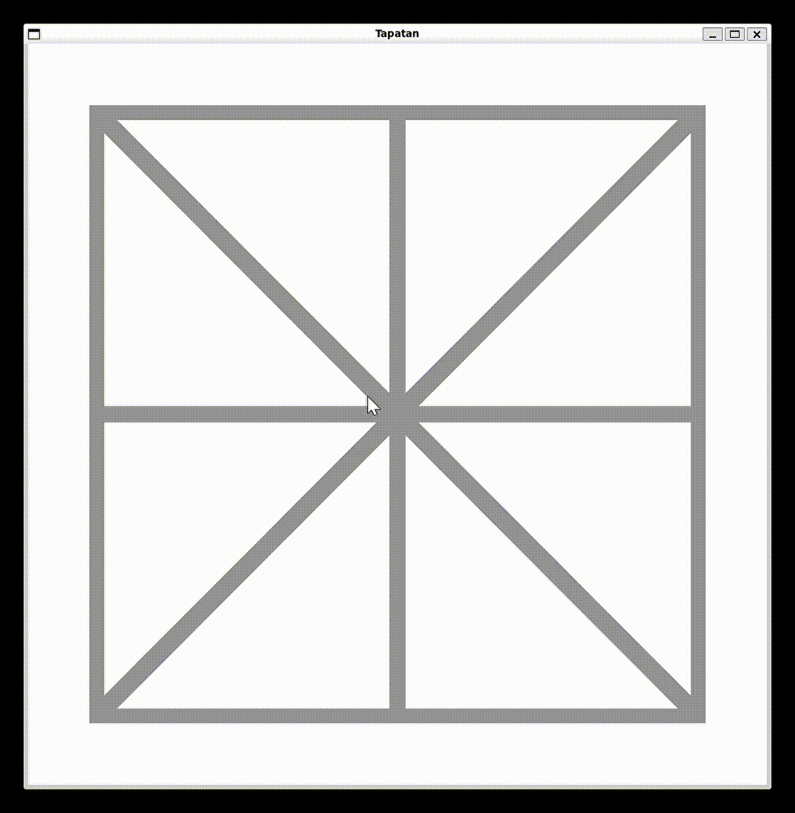

# 🟢🔵 Tapatan

## 📝 About

**Tapatan** is a personal project designed to replicate the traditional Philippine board game Tapatan (which is similar to Tic-Tac-Toe). 
I built this project to practice C++ and learn how to use a graphics library (*SFML*).

### 🧠 Rules of the Game

The goal is to align 3 of your pawns in a row (either vertically, horizontally, or diagonally).
The board consists of a 3x3 grid of points.



The game is divided into two phases:
1. **Drop Phase:** At the start of the game, players take turns placing 1 pawn at a time on any empty point on the board.
2. **Move Phase:** Once both players have placed all 3 of their pawns, they take turns moving one of their pawns to an available adjacent position.

It's a simple yet fun strategy game. Trick your opponent into moving where you want them to, and set up your win from the very beginning!

> **Note:** Tapatan goes by multiple names around the world, such as *Three Men's Morris* in English or *Trois-points* in French.

## 🕹️ Features

You can select 2 mode of playing :
- Playing in the shell
- Playing in the a window (SFML)

Simply select it at the start of the program :
```sh
> ./tapatan
Do you want to play in shell or in a window ? (s/w)
```

### ♟️ How to Play

#### On the Terminal (Shell)



* **Navigate:** Use the arrow keys.
* **Drop Phase:** Press `Space` to place your pawn.
* **Move Phase:** Press `Space` to select a pawn, navigate to an empty adjacent spot, and press `Space` again to move it.

#### On the Window (SFML)



Everything is fully playable with the mouse. Simply **left-click** to place, select, and move your pawns.

## 🚀 Getting Started

### Prerequisites

Make sure you have a **C++ compiler** (like GCC or Clang) and the **SFML library** installed on your system.

### Setup and Running

1. **Build the Game**
```sh
make
```

2. **Run the Game:**
```sh
./tapatan
```

3. **Clean the project:**
```sh
make clean
```

*or*

```sh
make fclean
```
